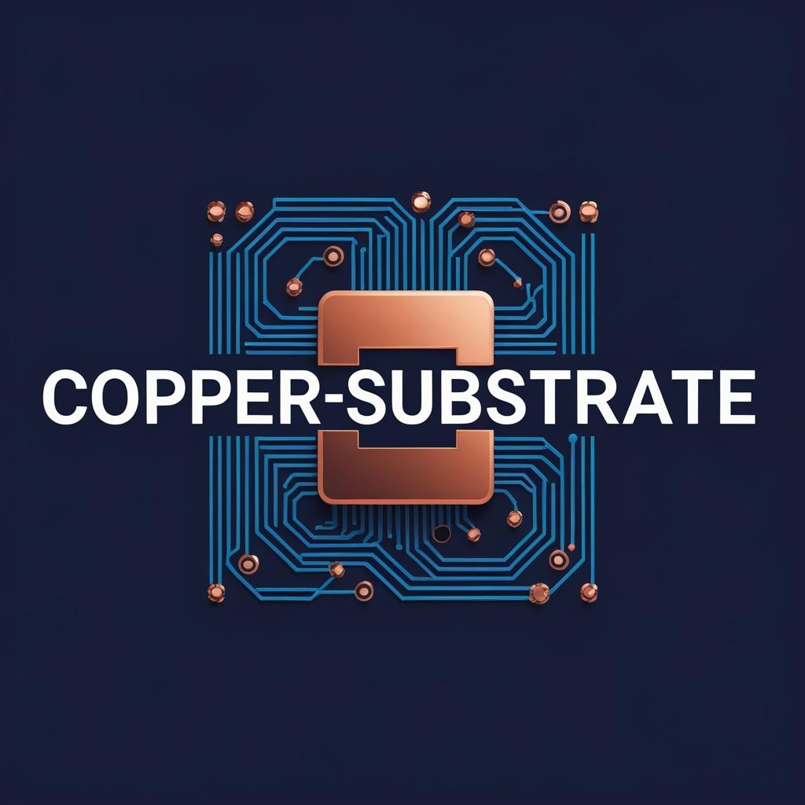

<div align="center">
</img>

## Imagining a New Era PCB Engine 


[](https://blog.rust-lang.org/2022/11/03/Rust-1.65.0.html)
[](https://opensource.org/licenses/MIT)

</div>

A forward-looking Printed Circuit Board Electronic Design Automation Engine built on a polymorphic, trait-based architecture in Rust. 

## Overview

copper-substrate is a conceptual framework for a new generation PCB design engine that leverages Rust's powerful trait system to create a polymorphic approach to PCB component modeling. Unlike traditional PCB tools that rely on rigid hierarchies or format-specific representations, copper-substrate introduces the concept of a "Board Composable Object" - a universal interface that any PCB element can implement.

With the introduction of various Rust based tools in the EDA space, there is a tangible momentum where construction of an entirely new
PCB engine is possible. Some of these tools include the entire gamut
of gerber processing crates from [`MakerPnP`](https://www.github.com/MakerPnp) organization and resultant
attempt to make extensible KiCad backend with tools like [`KiForge.`](https://www.github.com/saturn77/KiForge.git) 

There is also the attempt to have new programmatic PCB tools - such
as the new software introduced by [`Jitx`](https://www.jitx.com) which is a programmatic approach to both schematic and pcb design built upon a new language Stanza. This is a holistic approach to developing hardware designs, programmatically driven. Where `copper-substrate` is different is in the more direct approach to composition of elements, making for a more generic approach. 

While there have been similar attempts in the past at a more behavioral approach to design, the introduction of Rust facilitates
the implementation of such ideas. While a language such as Python or 
C++ could have been chosen, Rust was selected for its performant and 
thread safe memory operations, while having a growing ecosystem
of EDA tools. 

## Getting Started
The crate has yet been published to `crates.io` so for initial evaluation
one should pull the crate and run the examples. Right now the main supported
backend is `KiCad`. 


To run the examples:

```bash
  git clone git@github.com:saturn77/copper-substrate.git 
  cd copper-substrate

  cargo run --example capacitor
  cargo run --example resistor
```

## Key Concepts

The overall theme of copper-substrate is to provide extensible descriptions of any pcb component - that includes the mechanical,
electrical, or actual physics domains. But concentrating on the 
electrical and mechanical, the generic traits of copper-substrate should capture all required attributes of an object to make a printed circuit board object - regardless of the EDA tool chosen. 


### 🔧 Polymorphic Design Through Rust Traits

At the heart of copper-substrate is the `BoardComposableObject` trait, which serves as a polymorphic substrate for all PCB components. This approach provides:

- **Universal Interface**: A single trait that defines the complete behavior of any board element
- **Type Erasure**: Components can be treated uniformly as `dyn BoardComposableObject`
- **Extensibility**: New component types integrate seamlessly by implementing the trait
- **Composability**: Complex components can be built from simpler ones while maintaining the interface

### 📦 Board Composable Objects

Every PCB element - from simple resistors to complex FPGAs - is represented as a Board Composable Object that implements:

- **Component Classification**: SMT/THT, electrical/mechanical, passive/active
- **Functional Identity**: Rich taxonomy through the `FunctionalType` enum
- **Geometric Properties**: Bounding boxes, pad descriptors, courtyard definitions
- **Footprint Generation**: Text elements, graphics, 3D models
- **Format-Agnostic Export**: Clean separation between component definition and output format

### 🏗️ Architectural Advantages

1. **Type Safety**: Rust's compiler ensures all components implement the complete interface
2. **Format Independence**: Core abstractions don't depend on KiCad, Altium, or any specific format
3. **Automatic Features**: Common functionality like courtyard generation comes built-in
4. **Rich Metadata**: Components carry comprehensive information beyond just geometry
5. **Future-Proof**: New package types, layer types, and component categories can be added without breaking existing code

## Example Usage

```rust
use copper_substrate::substrate::prelude::*;

// Define a custom component
struct Capacitor {
    value: String,
    package: Package,
}

// Implement the polymorphic interface
impl BoardComposableObject for Capacitor {
    fn functional_type(&self) -> FunctionalType {
        FunctionalType::Capacitor(self.value.clone())
    }
    
    fn footprint_name(&self) -> String {
        format!("C_{}", self.package)
    }
    
    // ... implement other required methods
}

// Use it like any other board object
let cap = Capacitor {
    value: "100nF".to_string(),
    package: Package::SMT("0603".to_string(), 1.27),
};

// Export to KiCad format (or any other supported format)
let footprint = cap.to_kicad_footprint();
```

## Project Structure

```
copper-substrate/
├── src/
│   ├── lib.rs                 # Public API and re-exports
│   ├── substrate/             # Core framework
│   │   ├── board_interface.rs # The BoardComposableObject trait
│   │   ├── functional_types.rs # Component taxonomy
│   │   ├── package_types.rs   # Physical packaging definitions
│   │   ├── layer_type.rs      # PCB layer system
│   │   └── courtyard.rs       # Automatic courtyard generation
│   └── exporters/             # Format-specific exporters
│       └── kicad_pcb_export.rs # KiCad format implementation
└── examples/
    ├── capacitor.rs           # Example capacitor implementation
    └── resistor.rs            # Example resistor implementation
```

## Design Philosophy

copper-substrate represents the following viewpoints:

- **Components as Interfaces**: Rather than data structures, components are defined by their behavior
- **Composition over Inheritance**: Build complex components by combining simpler ones
- **Format as Export Concern**: Component definition is separate from file format representation
- **Extensibility by Design**: New component types don't require modifying core code
- **Type-Driven Development**: Let Rust's type system guide correct implementations

## Current Status

This is an early conceptual framework demonstrating the architectural approach. Current features include:

- ✅ Core `BoardComposableObject` trait definition
- ✅ Basic component examples (resistor, capacitor)
- ✅ KiCad footprint export
- ✅ Automatic courtyard generation
- ✅ Rich type system for packages, layers, and functional types

## Future Vision

The polymorphic architecture of copper-substrate enables:

- **Multi-Format Support**: Export to KiCad, Altium, Eagle, etc.
- **Parametric Components**: Generate families of components programmatically
- **Design Rule Checking**: Implement DRC as trait methods
- **3D Integration**: Full 3D model generation and visualization
- **AI-Assisted Design**: Train models on the standardized component interface
- **Cloud Collaboration**: Serialize board objects for distributed design

## Contributing

This project is in its conceptual phase and welcomes contributions that explore and extend the polymorphic architecture. Areas of interest include:

- Implementing additional component types
- Adding new export formats
- Exploring advanced trait compositions
- Performance optimizations for large designs
- Documentation and examples

## License

This project is licensed under the MIT License - see the [LICENSE](LICENSE) file for details.

---


